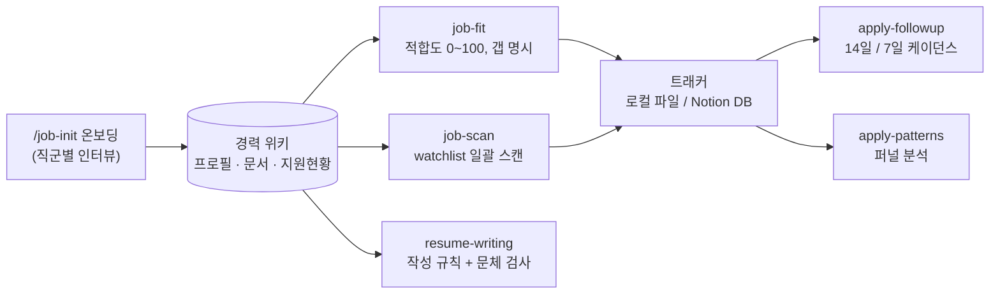

<div align="center">


**언어:** 한국어 | [English](docs/en/README.md)

[](LICENSE)
[](https://code.claude.com/docs/en/plugins/create)
-3776AB?logo=python&logoColor=white)


</div>

**한국 취업시장용 구직 코파일럿. 경력 위키 온보딩부터 공고 적합도 분석, 관심회사 스캔, 이력서·자소서 규칙, 지원 트래킹까지 플러그인 설치 한 번으로.**

> **스킬 6종** · **공고 소스 8종** · **E2E 검증 11/11 통과** · **Python 외부 의존성 0** · **설정 파일 1개**

실제 구직 기간에 수십 개 회사에 지원하며 매일 쓰던 개인 스킬 묶음을 남도 쓸 수 있게 일반화했다. 공고를 그럴듯하게 칭찬해주는 도구가 아니다 — 프로필에 없는 경험은 지어내지 않는다. 갭은 갭이라고 말하고 부적합이면 지원하지 말라고 한다. 목적은 지원 실패를 줄이는 것이다.

---

## 빠른 시작

```bash
# 1. 마켓플레이스 추가 + 설치
/plugin marketplace add LEEHYUNBOK/chwijun-copilot
/plugin install chwijun-copilot

# 2. 온보딩 (1회, 필수)
/chwijun-copilot:wiki-bootstrap
```

온보딩은 직군(개발·기획/PM·디자인·마케팅)을 먼저 묻는다. 직군에 맞는 질문으로 경력 위키 — 프로필·대표 작업 문서·지원현황 트래커 — 를 만들고 나면 자연어로 쓰면 된다.

```
이 공고 봐줘 https://...     → 적합도 분석 + 트래커 등록
새 공고 스캔해줘              → watchlist 회사 일괄 스캔
자소서 문항 좀 다듬어줘       → 작성 규칙 로드
답 없는 데 있나 봐줘          → 팔로업 점검
계속 떨어지는데 왜지          → 탈락 패턴 분석
```

로컬 테스트는 `claude --plugin-dir /path/to/chwijun-copilot`.

---

## 동작 방식

모든 스킬은 온보딩이 만든 **경력 위키 하나만** 정본으로 읽는다. 이력서를 매번 다시 파싱하지 않고, 모든 판정은 본인이 승인한 프로필로 소급된다.



프로필에는 「공백」 절이 필수다 — 없는 경험을 숨기지 않아야 적합도 판정이 작동한다. 과장된 프로필은 서류 통과율이 아니라 면접 탈락률을 올린다.

## 정직함이 설계다 — 실제 출력

E2E 검증에서 나온 실제 출력이다. 서비스기획자 테스트 프로필에 보안 엔지니어 공고(당근, Greenhouse API)를 넣었을 때:

```
## 적합도 하 · 5/100 · 현재는 부적합 · ⚠️ 직군 불일치 (기획 → 보안 엔지니어링)

### 결정적 갭
- 직군: 공고는 보안 엔지니어(Detection & Response), 프로필은 서비스기획. 직무 자체가 다름
- 연차: 침해사고·보안 이벤트 대응 실무 3년+ 요구 → 보안 실무 경력 0년
- 기술: SIEM/SOAR, 탐지 룰·자동화 — 전부 미보유

### 지원 전략
- 지원하지 않는 것을 권장
```

5/100에 "지원하지 말라" — 지어낸 스킬 없이 요구사항은 실제 공고 원문과 대조됐다. 이게 계약이다: **창작 금지**(못 가져온 요구사항은 만들지 않는다) + **아부 금지**(강점보다 갭을 먼저 쓴다).

---

## 무엇이 들어있나

| 구성요소 | 역할 |
|---|---|
| `agents/chwijun-copilot` | 요청을 맞는 스킬로 라우팅하는 진입점 — 스킬 이름을 외울 필요 없다 |
| `skills/wiki-bootstrap` | 온보딩. 직군 파악 → 인터뷰 → 경력 위키 스캐폴딩 → 설정 저장 |
| `skills/job-fit` | 공고 URL 하나의 적합도 분석(0~100점, 갭 명시) + 트래커 기록 |
| `skills/job-scan` | watchlist ATS·채용 사이트 일괄 스캔, 중복 제거, 회당 15건 상한 |
| `skills/resume-writing` | 이력서·경력기술서·자소서 작성 규칙 + AI 문체 제거 + 문체 기계검사 |
| `skills/apply-followup` | 지원 후 무응답 점검 — 한국 관행 케이던스(서류 14일, 전형 사이 7일, 문의는 회사당 1회) |
| `skills/apply-patterns` | 지원 퍼널·탈락 패턴 분석 — 표본 5건 미만이면 패턴 명명을 멈춘다 |
| `scripts/` | fetch_jd.py(ATS별 수집기) · track_add.py(Notion 트래커) · check_voice.py(문체 검사) |
| `templates/` | 프로필·위키 문서·지원현황 트래커·watchlist 양식 |

## 한국 시장 함정 지식 내장

범용 구직 도구가 모르는 것들이 스킬 본문에 박혀 있다 — 전부 실제 구직에서 한 번씩 당하고 배운 것이다.

- **원티드 유령공고** — 목록에 보여도 `status`가 close면 등록하지 않는다
- **사람인 상세는 쿠키 필수** — 쿠키 없이 호출하면 조용히 다른 공고 본문이 온다. fetch_jd.py가 절차를 내장
- **사람인은 발췌본** — 자체 ATS가 있는 회사는 그쪽이 정본이다
- **공고 소스 8종** — 원티드 · 사람인 · 자소설닷컴 · LG Careers · Greenhouse · Ashby · greetinghr(호스팅/임베드) · 일반 Next.js/HTML
- **팔로업은 회사당 1회** — 한국 관행상 2회는 역효과

## 설정 파일

온보딩이 `~/.claude/chwijun-copilot.json`을 만든다.

```json
{ "wiki_path": "<경력위키 절대경로>", "tracker": "local", "notion_ds_id": "" }
```

- `tracker: "local"`(기본) — 지원 기록은 위키의 지원현황.md에 쌓인다. 추가 설정 없음
- `tracker: "notion"` — `notion_ds_id` + `NOTION_TOKEN` 설정 시 Notion DB에 행 추가

## 데이터

프로필·위키·지원 기록 전부 본인 머신의 위키 폴더에만 남는다. 외부 전송은 Notion 트래커를 직접 켰을 때의 Notion API 호출이 전부다.

## 로드맵

- [ ] 깨끗한 머신에서 자연어 라우팅 검증
- [x] `track_add.py --list` — Notion 트래커 읽기(중복 제거·전수 조회)
- [ ] 풀 퍼널 스킬 — interview-practice · offer-comparison · salary-negotiation

## 라이선스

[MIT](LICENSE)
