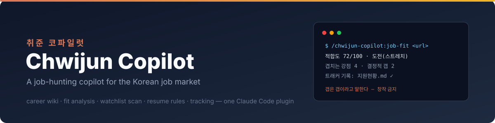
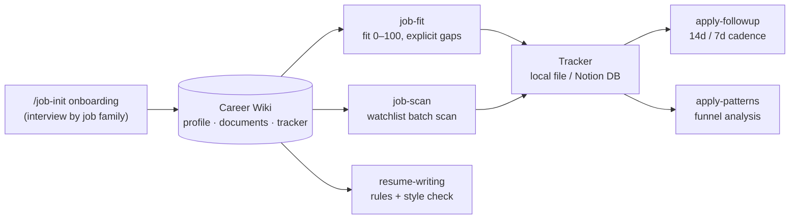

<div align="center">



**Language:** [한국어](../../README.md) | English

[](../../LICENSE)
[](https://code.claude.com/docs/en/plugins/create)
-3776AB?logo=python&logoColor=white)


</div>

**A job-hunting copilot for the Korean job market. Career-wiki onboarding, posting fit analysis, company watchlist scanning, resume/cover-letter rules, and application tracking — all in one Claude Code plugin install.**

> **6 skills** · **8 posting sources** · **11/11 E2E checks passed** · **0 Python dependencies** · **1 config file**

This is a generalized version of the personal skill set I used daily while applying to dozens of companies during an actual job search. It is not a tool that flatters you into applying — it never invents experience that isn't in your profile, it calls a gap a gap, and when a posting is a bad fit it tells you not to apply. The goal is fewer failed applications.

> "Chwijun" (취준) is Korean shorthand for 취업 준비 — job hunting.

---

## Quick Start

```bash
# 1. Add the marketplace and install
/plugin marketplace add LEEHYUNBOK/chwijun-copilot
/plugin install chwijun-copilot

# 2. Onboard (once, required)
/chwijun-copilot:wiki-bootstrap
```

Onboarding asks your job family first (engineering / product·PM / design / marketing), then interviews you with questions tuned to that family and scaffolds your career wiki — profile, work documents, and an application tracker. After that, plain language works:

```
Look at this posting https://...   → fit analysis + tracker entry
Scan for new postings              → batch-scan your watchlist companies
Polish my cover letter answer      → loads the writing rules
Anyone gone quiet on me?           → follow-up check
Why do I keep getting rejected?    → funnel / rejection pattern analysis
```

For local testing: `claude --plugin-dir /path/to/chwijun-copilot`.

📖 **Step-by-step [user guide with screenshots](../사용설명서.md)** (Korean) — every screenshot is real output from QA verification runs.

---

## How It Works

Every skill reads from **one career wiki** that onboarding creates. Your resume is never re-parsed per request, and every verdict traces back to a profile you approved.



The profile has a mandatory **gaps** section — fit analysis only works if missing experience isn't hidden. An inflated profile doesn't raise your pass rate; it raises your interview rejection rate.

## Honest by Design — Real Output

From the E2E verification run: a product-manager test profile against a security-engineer posting (Daangn, via Greenhouse API). The copilot's verdict:

```
## 적합도 하 · 5/100 · 현재는 부적합 · ⚠️ 직군 불일치 (기획 → 보안 엔지니어링)

### 결정적 갭
- 직군: 공고는 보안 엔지니어(Detection & Response), 프로필은 서비스기획. 직무 자체가 다름
- 연차: 침해사고·보안 이벤트 대응 실무 3년+ 요구 → 보안 실무 경력 0년
- 기술: SIEM/SOAR, 탐지 룰·자동화 — 전부 미보유

### 지원 전략
- 지원하지 않는 것을 권장
```

Fit 5/100, "don't apply" — no invented skills, requirements cross-checked against the actual posting text. That's the contract: **no fabrication** (unfetched requirements are never made up) and **no flattery** (gaps are listed before strengths).

---

## What's Inside

| Component | Role |
|---|---|
| `agents/chwijun-copilot` | Entry-point router — no skill names to memorize |
| `skills/wiki-bootstrap` | Onboarding: job family → interview → career wiki scaffolding → config |
| `skills/job-fit` | Fit analysis for one posting URL (0–100 score, explicit gaps) + tracker entry |
| `skills/job-scan` | Batch scan of watchlist ATSs and job boards, dedup, 15-per-run cap |
| `skills/resume-writing` | Resume / career statement / cover-letter rules + AI-tone removal + mechanical style check |
| `skills/apply-followup` | Post-application silence check — Korean-convention cadence (14 days for documents, 7 between stages, one inquiry per company) |
| `skills/apply-patterns` | Funnel and rejection pattern analysis — refuses to name patterns under 5 samples |
| `scripts/` | fetch_jd.py (per-ATS collector) · track_add.py (Notion tracker) · check_voice.py (style checker) |
| `templates/` | Profile, wiki document, tracker, and watchlist templates |

## Korean-Market Trap Knowledge, Built In

Things generic job tools don't know, written into the skill bodies — each one learned the hard way during a real job search:

- **Wanted (원티드) ghost postings** — listed but `status: close` means do not register
- **Saramin (사람인) detail pages require cookies** — without them you silently get a *different posting's* body; fetch_jd.py handles the cookie dance
- **Saramin is an excerpt** — companies with their own ATS have the authoritative posting there
- **8 posting sources** — Wanted · Saramin · Jasoseol · LG Careers · Greenhouse · Ashby · greetinghr (hosted/embedded) · generic Next.js/HTML
- **One follow-up per company** — Korean convention; a second inquiry backfires

## Config

Onboarding writes `~/.claude/chwijun-copilot.json`:

```json
{ "wiki_path": "<absolute path to career wiki>", "tracker": "local", "notion_ds_id": "" }
```

- `tracker: "local"` (default) — applications accumulate in the wiki's tracker file; zero extra setup
- `tracker: "notion"` — set `notion_ds_id` + `NOTION_TOKEN` to append rows to a Notion database

## Data

Your profile, wiki, and application history stay in the wiki folder on your machine. The only outbound traffic is the Notion API when you explicitly enable the Notion tracker.

## Roadmap

- [ ] Natural-language routing verification on a clean machine
- [ ] `track_add.py --list` — Notion tracker reads (dedup, full scans)
- [ ] Full-funnel skills — interview practice · offer comparison · salary negotiation

## License

[MIT](../../LICENSE)
