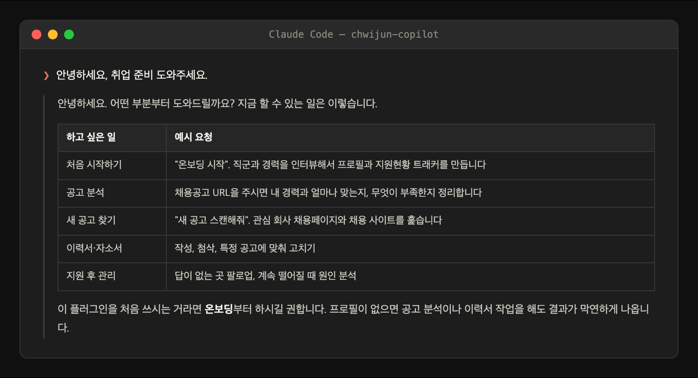
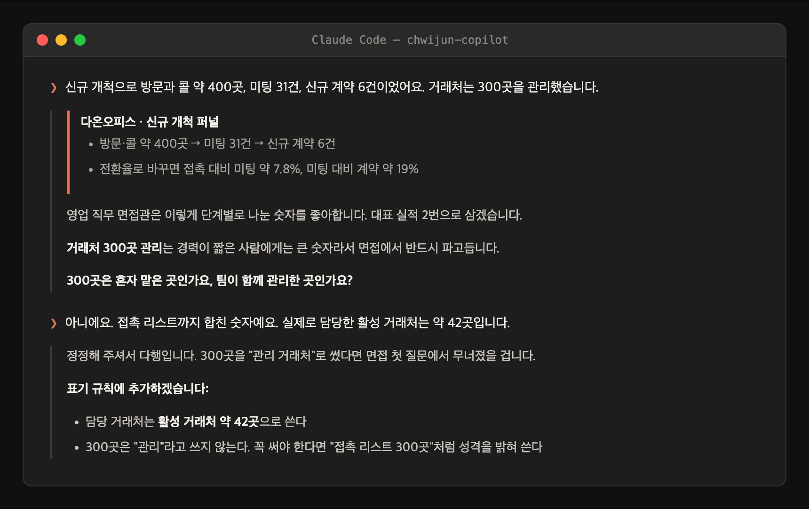
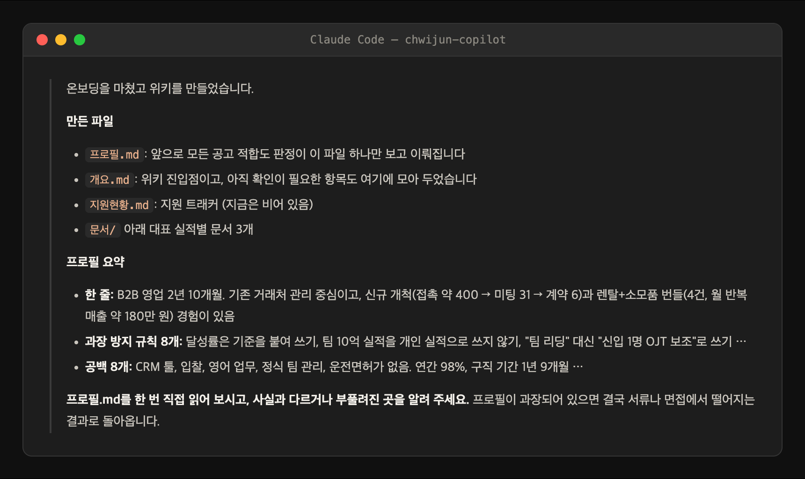
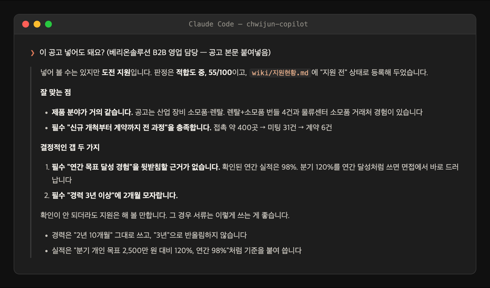
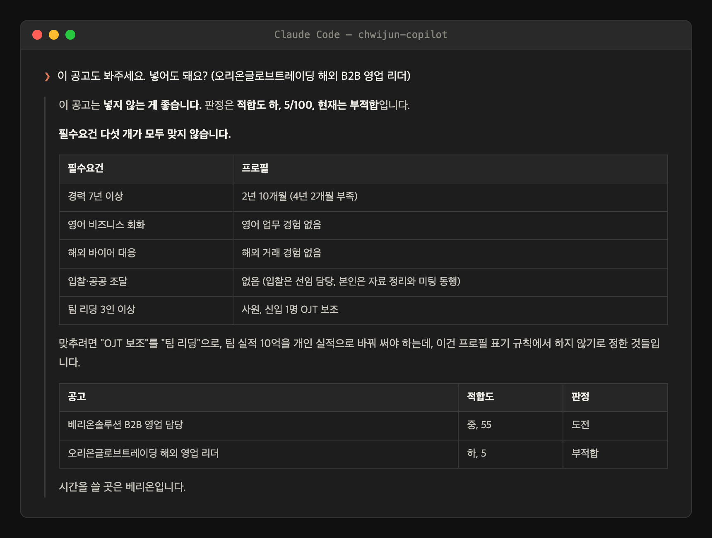
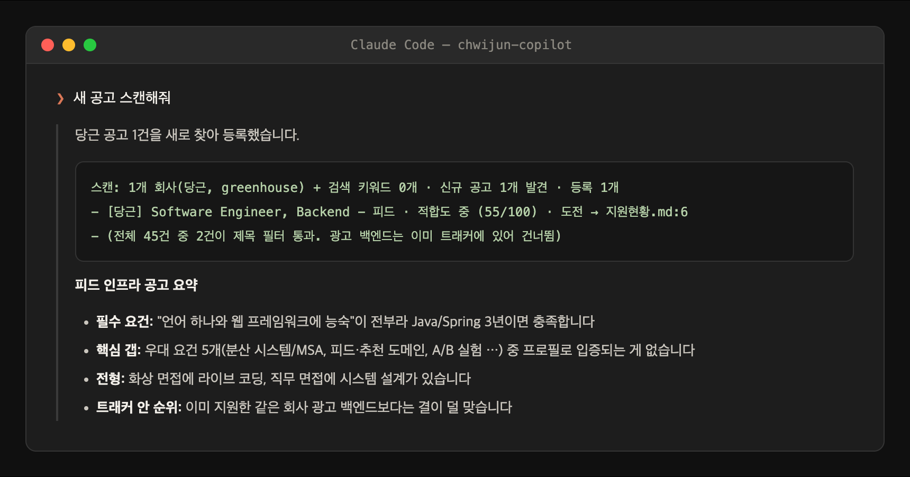
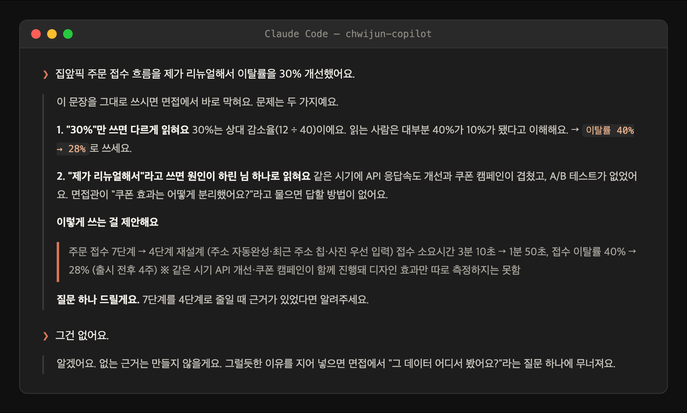
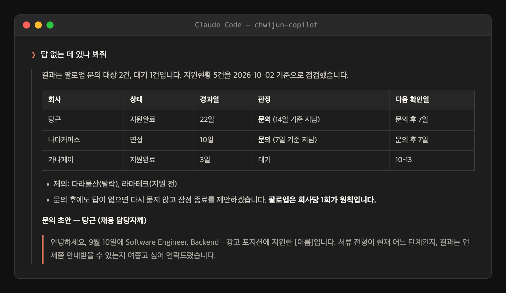
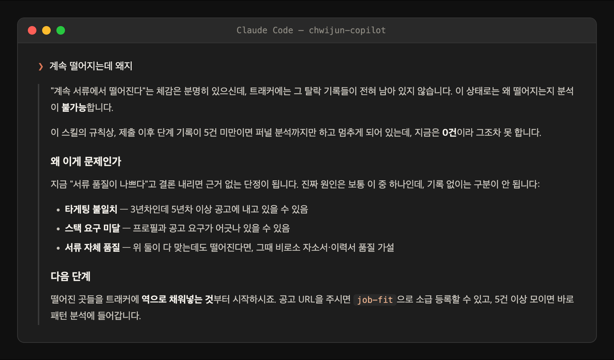

# 사용설명서

설치부터 지원 후 관리까지, 실제 쓰는 순서대로 따라가는 매뉴얼이다.

> 아래 화면은 전부 **QA 검증 런에서 나온 실제 출력**이다 (다직군 시뮬레이션 8직군 9런, E2E 검증 로그). 보기 좋게 다듬거나 지어낸 응답이 아니다. 길이만 발췌로 줄였다.

## 차례

1. [설치](#1-설치)
2. [첫 대화 — 뭘 할 수 있나](#2-첫-대화--뭘-할-수-있나)
3. [온보딩 — 경력 위키 만들기](#3-온보딩--경력-위키-만들기)
4. [공고 적합도 분석 (job-fit)](#4-공고-적합도-분석-job-fit)
5. [관심 회사 일괄 스캔 (job-scan)](#5-관심-회사-일괄-스캔-job-scan)
6. [이력서·자소서 (resume-writing)](#6-이력서자소서-resume-writing)
7. [지원 후 팔로업 (apply-followup)](#7-지원-후-팔로업-apply-followup)
8. [탈락 패턴 분석 (apply-patterns)](#8-탈락-패턴-분석-apply-patterns)
9. [설정 파일과 트래커](#9-설정-파일과-트래커)
10. [자주 걸리는 것들](#10-자주-걸리는-것들)

---

## 1. 설치

Claude Code 안에서 세 줄이면 끝난다. 세 번째 명령(온보딩)은 설치 후 1회 필수다.


로컬에서 클론해 테스트하려면 설치 대신 `claude --plugin-dir /path/to/chwijun-copilot`로 실행하면 된다.

## 2. 첫 대화 — 뭘 할 수 있나

스킬 이름을 외울 필요 없다. 그냥 말을 걸면 에이전트가 맞는 스킬로 라우팅하고, 처음이면 할 수 있는 일을 먼저 보여준다.



안내대로 **온보딩부터** 하는 게 맞다. 프로필 없이 공고 분석을 요청하면 판정을 거부하고 온보딩으로 안내한다 — 근거 없는 판정을 만들지 않기 위한 설계다.

## 3. 온보딩 — 경력 위키 만들기

`/chwijun-copilot:wiki-bootstrap`을 실행하면 직군(개발·기획/PM·디자인·마케팅, 그 외 직접 입력)을 먼저 묻고, 직군에 맞는 질문으로 경력을 인터뷰한다.

이 인터뷰는 받아 적기만 하지 않는다. **숫자의 근거를 확인하고, 과장될 수 있는 표현은 그 자리에서 교정한다.** 실제 장면:



인터뷰가 끝나면 경력 위키가 만들어진다. 프로필에는 잘한 것만이 아니라 **「공백」 절과 「과장 방지 표기 규칙」**이 같이 남는다. 이게 이후 모든 판정의 기준이 된다.



끝나고 할 일은 하나다: `프로필.md`를 직접 읽고, 사실과 다른 곳을 고쳐달라고 말하면 된다.

## 4. 공고 적합도 분석 (job-fit)

공고 URL을 주거나 본문을 붙여넣고 "이 공고 봐줘"라고 하면 된다. 적합도 0~100점과 함께 **갭을 먼저** 말하고, 트래커에 "지원 전" 상태로 등록한다.

갭이 있어도 해볼 만하면 **도전**으로 판정하고, 서류를 어떻게 쓰면 되는지까지 같이 준다:



안 맞으면 안 맞는다고 한다. 점수를 후하게 주거나 없는 경험을 만들어 맞춰주지 않는다:



부적합 판정에도 "그래도 넣고 싶다"고 하면 막지 않는다. 대신 지원하면 어떻게 되는지(예상 결과, 잃는 것, 얻는 것)를 설명하고, 과장 없이 내는 조건으로 서류를 같이 쓴다.

지원되는 공고 소스는 8종이다: 원티드 · 사람인 · 자소설닷컴 · LG Careers · Greenhouse · Ashby · greetinghr · 일반 HTML. URL이 404거나 본문을 못 가져오면 **짐작으로 판정하지 않고** 본문을 붙여넣어 달라고 한다.

## 5. 관심 회사 일괄 스캔 (job-scan)

관심 회사를 `wiki/watchlist.json`에 넣어두면 (양식: `templates/watchlist.json`) "새 공고 스캔해줘" 한마디로 전부 훑는다. 이미 트래커에 있는 공고는 건너뛰고, 새 공고만 적합도 분석해서 등록한다. 회당 15건 상한.



## 6. 이력서·자소서 (resume-writing)

"자소서 다듬어줘", "이력서 봐줘"라고 하면 작성 규칙이 로드된다. 핵심은 **문장을 예쁘게 만드는 게 아니라, 면접에서 무너질 문장을 미리 잡는 것**이다. 실제 장면:



마지막 두 줄이 이 플러그인의 계약이다 — 근거가 없으면 지어 넣지 않는다. AI 문체 제거 규칙과 기계 검사(`scripts/check_voice.py`)도 포함돼 있다.

## 7. 지원 후 팔로업 (apply-followup)

"답 없는 데 있나 봐줘"라고 하면 트래커의 지원 건들을 점검해서 문의할 곳과 기다릴 곳을 나눠준다. 기준은 한국 관행 케이던스다: 서류 14일, 전형 사이 7일, **문의는 회사당 1회**.



## 8. 탈락 패턴 분석 (apply-patterns)

"계속 떨어지는데 왜지"라고 하면 트래커 기록으로 퍼널을 분석한다. 단, **표본이 5건 미만이면 패턴을 명명하지 않는다.** 데이터가 없으면 없다고 말하고, 채우는 방법부터 안내한다:



## 9. 설정 파일과 트래커

온보딩이 `~/.claude/chwijun-copilot.json` 하나를 만든다. 설정은 이게 전부다.

```json
{ "wiki_path": "<경력위키 절대경로>", "tracker": "local", "notion_ds_id": "" }
```

| 설정 | 동작 |
|---|---|
| `tracker: "local"` (기본) | 지원 기록이 위키의 `지원현황.md`에 쌓인다. 추가 설정 없음 |
| `tracker: "notion"` | `notion_ds_id`에 DB id, 환경변수 `NOTION_TOKEN` 설정 시 Notion DB에 행 추가 |

프로필·위키·지원 기록은 전부 본인 머신에만 남는다. 외부 전송은 Notion 트래커를 직접 켰을 때의 Notion API 호출이 전부다.

## 10. 자주 걸리는 것들

**온보딩 없이 공고 분석을 시키면?**
판정하지 않는다. 프로필이 없으면 비교할 기준이 없어서다. 온보딩(5~15분)을 먼저 하라고 안내한다.

**공고 URL이 404로 나온다**
공고가 마감돼 내려갔거나 주소가 잘못 복사된 경우다. 공고 본문(회사명·직무·자격요건·우대사항)을 직접 붙여넣으면 똑같이 분석된다.

**적합도 점수가 너무 짜다**
의도된 동작이다. 프로필로 입증되지 않는 요구사항은 전부 갭으로 센다. 점수를 올리는 방법은 프로필에 실제 경험을 더 채우는 것뿐이다.

**인터뷰에서 자꾸 "누구 목표 대비인지", "혼자 한 건지" 되묻는다**
그것도 의도다. 기준 없는 숫자와 팀 성과의 개인화가 서류 탈락이 아니라 **면접 탈락**을 만들기 때문에, 위키에 들어가기 전에 잡는다.

**Claude Code가 없다 (ChatGPT·Gemini 사용자)**
`chatbot/` 폴더에 라이트판이 있다. ChatGPT Projects·Gemini Gem에 붙여넣는 지침과 지식 파일로 핵심 규칙(적합도 판정·작성 규칙·팔로업)을 쓸 수 있다. 위키·트래커·스캔 같은 파일 기반 기능은 Claude Code 전용이다.
